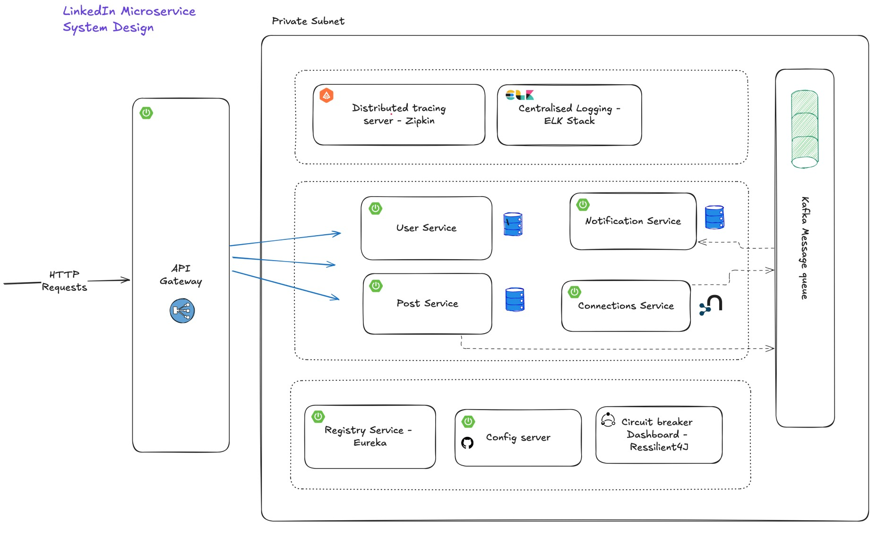
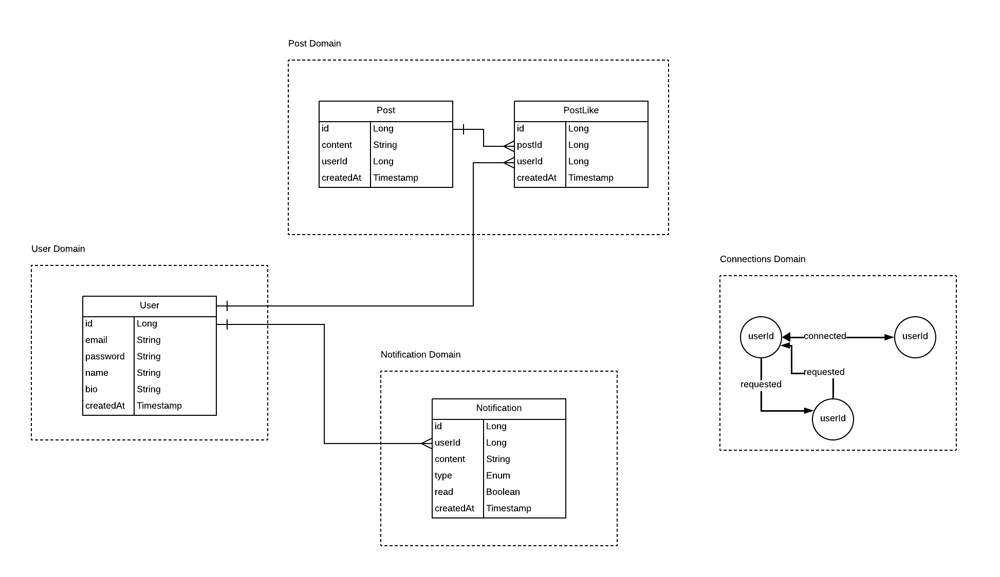

# LinkedIn Clone

A scalable LinkedIn-like social networking platform built using microservices architecture and deployed on Google Cloud. This project leverages Docker and Kubernetes for container orchestration, along with Kafka for inter-service communication.

## Features
- User authentication and profile management
- Creating and managing posts
- Connection requests and friend network
- Real-time notifications
- API Gateway for centralized request handling
- Eureka Discovery Server for service registry
- Kafka for event-driven communication

## Tech Stack
- **Backend:** Java (Spring Boot)
- **Database:** PostgreSQL, Neo4j
- **Messaging Queue:** Apache Kafka
- **Service Discovery:** Eureka
- **Orchestration & Deployment:** Docker, Kubernetes
- **Cloud Provider:** Google Cloud Platform (GCP)
- **API Gateway:** Spring Cloud Gateway

## Microservices Overview


1. **User Service** - Manages user profiles, authentication, and authorization.
2. **Posts Service** - Handles creating, updating, and fetching posts.
3. **Connections Service** - Manages connection requests and friendships, utilizing **Neo4j** for efficient retrieval of first-degree connections.
4. **API Gateway** - Serves as the central entry point for all requests.
5. **Eureka Discovery Server** - Service registry for dynamic service discovery.
6. **Notifications Service** - Sends real-time notifications to users.
7. **Kafka Integration** - Enables asynchronous messaging between microservices.

## API Endpoints
### User Service
- `POST /api/v1/users/auth/signup` - Register a new user
- `POST /api/v1/users/auth/login` - Authenticate user

### Posts Service
- `POST /api/v1/posts/core` - Create a new post
- `GET /api/v1/posts/core/{userId}/allPosts` - Fetch user posts
- `GET /api/v1/posts/core/{postId}` - Fetch post by post id

### Connections Service
- `POST /api/v1/connections/request/{userId}` - Send connection request
- `POST /api/v1/connections/accept/{userId}` - Accept connection request
- `GET /api/v1/connections/first-degree` - Get all first degree connections
- `GET /connections/{userId}` - Get user connections (leveraging **Neo4j** for optimized queries)

## Database Overview

The **LinkedIn Clone** utilizes **PostgreSQL** and **Neo4j** for handling different parts of the system:

- **PostgreSQL**: A relational database used for storing user profiles, authentication data, and posts. It ensures strong consistency and handles transactional data efficiently.

- **Neo4j**: A graph database used for managing user connections (friendships and requests), optimized for fast relationship queries and graph traversals.

This dual-database approach ensures scalability, performance, and efficient querying of user data and connections. Kafka is used for event-driven communication between microservices.



## Kafka Integration
Kafka is used to handle inter-service communication for events such as:
- New connection requests
- New post creation notifications
- Real-time updates on user activities

## Deployment

The project is deployed on Google Cloud Platform (GCP) using Kubernetes for container orchestration.

### Steps to Deploy:
1. **Containerization using Jib Maven Plugin**
    - The project uses the **Jib Maven Plugin** to build and push Docker images directly to Docker Hub without needing a `Dockerfile`.
    - The plugin is attached to the `mvn package` lifecycle, automating the process.

   ```sh
   cd user-service && mvn clean package jib:build
   cd ../posts-service && mvn clean package jib:build
   cd ../connections-service && mvn clean package jib:build
   cd ../api-gateway && mvn clean package jib:build
   cd ../eureka-server && mvn clean package jib:build
   cd ../notifications-service && mvn clean package jib:build
   ```
    - This will create and push the containerized microservices to Docker Hub.

2. **Push Images to Docker Hub** (Handled by Jib automatically)
    - Ensure that the `pom.xml` is configured with the correct repository details.

3. **Deploy to Kubernetes**
   ```sh
   kubectl apply -f k8s/
   ```

## Future Enhancements
- Implement CI/CD pipeline
- Add GraphQL support for efficient querying
- Enhance security with OAuth2

## Contributing
Feel free to fork this repository and submit pull requests for improvements.
